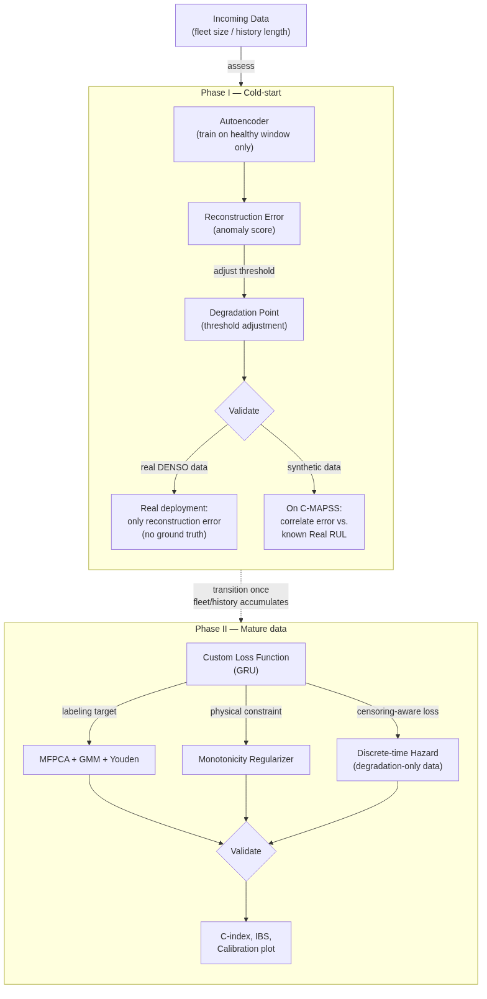

# Table of Contents

1.  [Diagram](#org152635b)
2.  [Project&rsquo;s information](#org244a057)
    1.  [Problem Statement](#org152261f)
        1.  [Denso&rsquo;s problem](#orgb48de93)
        2.  [Analyze their solution](#org8746c92)
        3.  [Our solution](#org9125c72)
    2.  [Reality Facts](#org4ea939f)
        1.  [The data is not that beautiful &hellip;](#orgf7277a6)
        2.  [The data isn&rsquo;t avaiable](#orgc14076f)
        3.  [The engine won&rsquo;t work in sync](#org01bcc98)
        4.  [Recored data maybe not in the right shape](#org3205d41)
        5.  [The engine won&rsquo;t behave the same after getting maintainance](#org881e045)
    3.  [Potential Question](#org55d969a)
        1.  [Why for Tier 2/3](#org3b5b334)
        2.  [Why do u choose these model but not anything which are better? (transformer/lstm)](#orgfa98322)
        3.  [Is it really worth for phaseII?](#org33e1aa3)
        4.  [How will the model work ?](#org324604e)
        5.  [Why not using RMSE for validate check?](#orga092950)
    4.  [Best Features](#org13a2c6e)
        1.  [Categorical Feature](#org9e790c3)
        2.  [Interpretability?](#org4e42f6e)
        3.  [Visualization?](#orgfea5530)
    5.  [Suggestion](#org7f6b74c)
        1.  [Problem statement](#orgd0989bb)
        2.  [Demo](#orgbb2d927)
        3.  [Preview](#orgf26cd60)
        4.  [Why does this project fit into Deso&rsquo;s demand](#org61b2519)
3.  [Architecture](#org6717d88)
    1.  [Preprocess Phase](#org91177d2)
    2.  [Phase I : Con1d Autoencoder](#org1b9911c)
        1.  [Reference](#orgdf65edd)
        2.  [Structure](#org7296c5b)
        3.  [Purpose](#orgb2ee1fb)
    3.  [Data Generator (maybe)](#org040dd29)
    4.  [Transition Phase](#orgbe73aa6)
    5.  [Phase II : GRU - Hazard](#org4c32b54)
        1.  [Purpose](#org5562604)
        2.  [Custom loss function](#org22ee125)
    6.  [How to evaluate our model](#orgc313acc)
        1.  [Labeling + LSTM](#org40da412)
4.  
    1.  [Code pipeline](#orga1fa8fe)
        1.  [Simulation data (Minh is doing that)](#orgce01e31)
        2.  [Training for Smart-Conv1dAE (im doing that)](#org8839145)
        3.  [Prepare window for inference real-time](#orgb07185d)
        4.  [Adding VAE (fault index )](#orge7e58a9)
        5.  [Transition Phase](#orgcdf645f)
        6.  [Inference for I & II](#org2836568)
        7.  [Append optinal feature : VAE + GAN + Label](#orga3d182c)
    2.  [Question & Notes](#orgd9bd9a0)
        1.  [Asking for how and how much data will update (1 batch) in real-life](#org73ef190)
        2.  [Attention GRU](#org60fa738)

# Diagram

# Project&rsquo;s information

## Problem Statement

### Denso&rsquo;s problem

-   So they want us to create something that can generate anomaly data, to balance
    the data, but the purpose is still : to help the model be more accuracy in
    disadvantages condition.

### Analyze their solution

-   Their solution : create a generator that can distribute only possible anomaly,
    but it still need an amount of real data of that anomaly to actually make it
    happen. Though they will provide us some, but i think this solution is not good.

### Our solution

-   Our solution expect the [disadvantages](#org4ea939f) that happen in real life, and should be
    good enough even with only truncated data, and work in real-time
-   They did also provide 5M1E type of data which mean anomaly data that are
    verified by human
-   [ ] also they want a recall/F1 before and after (Youden Index)
-   Deep learning has shown a lot of promise in many different

fields for solving a variety of problems that have an abun- dance of data, such
as in image recognition, large language models and even in machinery prognostics
using deep neural networks as models. While deep learning has shown the abil-
ity to achieve highly accurate RUL predictions, but it often outputs point
estimates without quantifying the uncertainty (Peng et al., 2019) This work
presents a model that shows it is capable of state-of-the-art performance while
quantifying the uncertainty.

## Reality Facts

### The data is not that beautiful &hellip;

-   In reality, we can&rsquo;t just let the machine broken down just to get the data but
    always fix it after some degree of degradation signals
-   Therefore, we need to consider that our data will always contain mostly **health phase**

### The data isn&rsquo;t avaiable

-   One more thing is that if we have a new machine and get it into work. We can&rsquo;t
    just have all of it data immediately &hellip;
-   That&rsquo;s why we should consider this aspect

### The engine won&rsquo;t work in sync

-   We should consider that all the engines should work in different term of its

### Recored data maybe not in the right shape

-   The data maybe provide at form of minute, second &hellip;

### The engine won&rsquo;t behave the same after getting maintainance

## Potential Question

### Why for Tier 2/3

### Why do u choose these model but not anything which are better? (transformer/lstm)

-   Needed prove to show that these heavy model tend to be more overfitting than
    GRU
-   Because it more efficient with small size of data

### Is it really worth for phaseII?

-   Một điểm tôi khuyên bạn thành thật thừa nhận thay vì né tránh — vì nó thực ra
    làm lập luận của bạn mạnh hơn: đúng là có trường hợp Phase II không cần thiết
    — nếu máy đó rẻ, hậu quả hỏng thấp, chi phí kiểm tra thủ công thấp, thì cứ có
    cảnh báo từ AE là đủ, không cần đầu tư thêm phân tích sâu. Việc bạn chủ động
    nói ra ranh giới này (&ldquo;Phase II chỉ đáng đầu tư cho máy/dây chuyền có giá trị
    cao hoặc hậu quả hỏng nghiêm trọng — đúng kiểu máy nhập khẩu đắt tiền mà đề
    xuất ban đầu của bạn đang nhắm tới&rdquo;) sẽ cho ban giám khảo thấy bạn hiểu rõ
    trade-off chi phí-lợi ích của chính hệ thống mình đề xuất, không chỉ cố bán
    &ldquo;càng nhiều mô hình càng tốt&rdquo; — đây chính xác là điều phân biệt một đề xuất kỹ
    thuật trưởng thành với một đề xuất chỉ đang khoe số lượng thuật toán.

### How will the model work ?

1.  Q : &hellip; when we have new data

    -   So basically when we have new data, the model won&rsquo;t need to run all the
        pipeline again. It will only inference

2.  Q : &hellip; when engine complete theirs cycle

    -   So after getting maintain, its previous data and label will obviously getting
        store
    -   Also we should consider re-train after a period of time &hellip;

3.  Q : &hellip; on production line

    -   Because of its lightweight, it should work flawlessly on factory&rsquo;s machine.
        Right?

### Why not using RMSE for validate check?

## Best Features

### Categorical Feature

-   After the process of AE, we can get its bottleneck to actually decrease its
    dimension to use as optional feature that can increase the accuracy as the
    more time past
-   This Paper Please/CLAIRE.pdf is maybe the key for us to utilize this feature more, to get
    Interpretability & Visualization
-   So to use this feature for the phase II, we should consider about :
    -   fusion time : early, mid or late
    -

### Interpretability?

### Visualization?

## Suggestion

### Problem statement

-   Tham dự triển lãm Intelligent Asia Hanoi 2026 và các phiên talkshow chuyên đề
    về chuyển đổi số trong sản xuất, chúng tôi nhận thấy Việt Nam đang bước vào
    giai đoạn chuyển dịch mạnh mẽ hướng tới Smart Manufacturing, được thúc đẩy bởi
    loạt chính sách hỗ trợ từ Nhà nước dành cho doanh nghiệp và các cơ sở nghiên
    cứu. Trong bối cảnh đó, việc đầu tư máy móc nhập khẩu — vốn có chi phí lớn và
    thời gian khấu hao dài — đang được khuyến khích như một bước đi tất yếu để
    nâng cao năng lực sản xuất. Tuy nhiên, đi kèm với làn sóng đầu tư này là một
    khoảng trống đáng lo ngại: phần lớn các nhà cung cấp cấp 2, cấp 3 trong chuỗi
    cung ứng — nơi vận hành song song nhiều máy móc cùng loại nhưng lại có ngân
    sách và nhân lực kỹ thuật hạn chế — không có khả năng tiếp cận các công cụ
    đánh giá độ bền/dự đoán tuổi thọ (RUL) đi kèm, vốn thường bị khóa trong hệ
    sinh thái độc quyền và chi phí cao của chính hãng sản xuất máy. Tình trạng này
    càng trở nên cấp thiết khi nhiều khu công nghiệp hiện vẫn phụ thuộc phần lớn
    vào giám sát thủ công bằng con người — vừa tốn kém nhân lực, vừa thiếu nhất
    quán và không thể phát hiện sớm các dấu hiệu suy thoái tiềm ẩn. Nhu cầu về một
    giải pháp đánh giá sức khỏe/tuổi thọ máy móc — độc lập với hãng sản xuất, phù
    hợp với năng lực dữ liệu thực tế và chi phí vận hành của nhóm doanh nghiệp này
    — do đó không còn là câu hỏi &ldquo;có cần không&rdquo;, mà chỉ còn là vấn đề thời gian
    trước khi nó trở thành một yêu cầu bắt buộc trong chuỗi cung ứng công nghiệp
    4.0. Xuất phát từ thực trạng đó, chúng tôi đề xuất&hellip;

### Demo

-   At the overlap range of 2 main phase, we can check if the anomaly are provided
    the same between these 2 phase.

### Preview

-   Team information — gắn với năng lực đã chứng minh Không chỉ tên/trường — nêu
    rõ vì sao đội bạn phù hợp với chính bài toán này: bạn đã có RMSE 15.7 trên
    C-MAPSS, đã tham dự Intelligent Asia Hanoi, hiểu văn hóa TPM. Đây là slide tạo
    niềm tin ngay từ đầu, không phải thủ tục.
-   Problem statement and background — rút gọn thành 1 slide cốt lõi. Dùng đoạn
    dẫn dắt đã viết (Intelligent Asia → chính sách Smart Manufacturing → khoảng
    trống OEM khóa vendor → Tier 2/3 thiếu công cụ), nhưng rút gọn còn 3-4 câu
    trên slide, phần diễn giải đầy đủ để vào speaker note nếu template có chỗ đó.
    Thêm 1 số liệu thịnh (ví dụ chi phí IIoT trung bình cho SME) để tăng sức nặng.
-   Market analysis — so sánh trực tiếp với giải pháp hiện có. Đặt sản phẩm bạn
    bên cạnh Augury/SKF/Factory AI trong một bảng so sánh ngắn: họ đắt + khóa
    vendor, bạn rẻ + sensor-agnostic + nhẹ cho [Tier 2/3](#org3b5b334). Đây là slide dễ gây ấn
    tượng nhất vì cho thấy bạn hiểu thị trường thật, không chỉ hiểu thuật toán.
-   Technical design — trục chiều là sơ đồ pipelineĐây là phần nặng nhất — dùng
    chính sơ đồ pipeline vừa hoàn thiện làm hero visual của toàn bộ deck. Một
    slide cho toàn cảnh, sau đó tách riêng 1-2 slide zoom vào Phase I
    (autoencoder) và Phase II (MFPCA/hazard) với giải thích ngắn mỗi phần làm gì,
    tại sao cần.
-   Objectives and expected impact — gắn với mốc cụ thểNêu rõ cụ thể sẽ làm gì nếu
    được chọn vào top 10/top 5: ví dụ áp dụng pipeline lên dữ liệu thật từ Factory
    Tour, đo C-index/IBS cụ thể, xây demo dashboard. Tránh chung chung kiểu &ldquo;cải
    thiện hiệu suất sản xuất&rdquo; — càng đo đếm được càng tốt.
-   Relevance to competition theme — nói rõ không ngầm địnhMột câu hoặc hai câu
    kết nối trực tiếp với tên chủ đề &ldquo;Predictive & Knowledge AI&rdquo; — tránh để giám
    khảo tự suy ra, nêu thẳng.

### Why does this project fit into Deso&rsquo;s demand

một vấn đề phổ biến trong chẩn đoán máy móc là thiếu dữ liệu cho trạng thái lỗi. Cơ sở dữ liệu mất cân bằng — đặc biệt khi thiếu dữ liệu từ đối tượng đã hỏng — gây khó khăn lớn cho phân tích dữ liệu và học máy. Khi phần lớn dữ liệu đại diện cho đối tượng không hỏng, mô hình học máy có xu hướng học nhiều về nhóm này và ít về nhóm thiểu số (đối tượng hỏng). Điều này có thể dẫn đến overfitting&hellip; Một giải pháp có thể là tăng cường dữ liệu (augment) từ đối tượng hỏng. Tuy nhiên, trong bài báo này, một hướng tiếp cận khác được chọn — cho phép giám sát và chẩn đoán hiệu quả trạng thái hiện tại của hệ thống chỉ dựa trên đặc trưng học được từ trạng thái khỏe mạnh.

# Architecture

## Preprocess Phase

-   So FFT could be applied to the sensor that have repetation behaviour. We
    should change to **Frequency Domain** as it should lower the cost to run by apply
    a Physical Fact &hellip;
-   

## Phase I : Con1d Autoencoder

### Reference

-   [Dynamical Varaiational AE.pdf][BottleNeck.pdf]
-   Paper Please/ae2.pdf

### Structure

-   Basically the combination of Autoencoder (Neural Network) & Con1d is a type of
    structure inside the encoder/decoder of AE
-   I realized that we can&rsquo;t just use the latent space from normal AE to feed to
    GRU. As this latent space won&rsquo;t keep the information related to how severity
    of one engine, this leads to GRU is unusable
-   The solution is that we use Physicals Informed AE, which divided into 2 linear
    branch created by X where X is **sensor measurement** and using W as **Operational
    Conditions** to create $\hat{W}$
-   

### Purpose

-   Focus more on individual &hellip; therefore, we can pass the
    [The data isn&rsquo;t avaiable](#orgc14076f) problem
-   Its purpose is like a sensor which will measure the anomaly which are mainly
    affect how an engine work.

## Data Generator (maybe)

## Transition Phase

-   Recognize if the quantity and quality of current cluster to move on to next phase
-   Is it enough for quantity of engine?
-   Do all of that engine has anomaly detected?
-   So basically, if there are 50 engines in the dataset, but only 3 of them are
    satisfy the requirement, then can we start the phase II?
-   Yes we can because of GRU-hazard was made for that. All of the engine will
    still go to the phase II, they were all used to learn, if one was short , it
    was learned short, if one was long, it was learned long. Size is not a
    problem, as they was just &rsquo;knowledge&rsquo; for the ML to learn. The final result
    will only be accepted for 3 engines which are satisfy the requirement, the
    other will be considered as not worth to trust yet, up until they are
    satisfied. I think, the 3 engines should be evaluated more as the more
    informations with other engines, the better
-   Also we should consider create a Keeper that should only allow engine which
    has cycles more than X cycles &hellip; Imagine a cycle with only 3-4 , it won&rsquo;t
    give us any valuable information &hellip;

## Phase II : GRU - Hazard

### Purpose

-   Focus more about a cluster of unit
-   This focus mainly on find the moment we should step in to maintain , also if
    there is limitted in the number of engine which can be maintained
    simutaneously, this will provide the answer for which engine should be fixed first
-   This will benefit us for decrease the cost for the maintenance.

### Custom loss function

1.  Discrete-time Hazard

    -   is basically **Probability**
    -   has different loss function :
    
    $$\text{Loss}_t = -[y_t \log(\hat{y}_t) + (1 - y_t) \log(1 - \hat{y}_t)]$$

2.  Monotonicity Regularizer (Ham rang buoc don dieu)

    -   basically to make sure the percantage of the engine which will broken down can
        decrease &hellip; (ban chat chung phai tuyen tinh tang len)

## How to evaluate our model

-   Include C-index, IBS, Calibration and it is completely different from RMSE

### Labeling + LSTM

1.  Concordance Index (C-index)

    -   đây là chỉ số quan trọng nhất, tương đương AUC nhưng cho dữ liệu
        survival/censored. Nó đo: trong mọi cặp máy (i, j) mà bạn biết chắc máy nào
        &ldquo;hỏng trước&rdquo; (kể cả khi một trong hai bị censor, miễn còn so sánh được), mô
        hình có xếp hạng đúng thứ tự rủi ro không? C-index = 0.5 là đoán ngẫu nhiên,
        1.0 là hoàn hảo. Đây là chỉ số bạn nên báo cáo làm &ldquo;con số chính&rdquo; thay thế vai
        trò của RMSE trước đây, vì nó đánh giá đúng bản chất bài toán bạn đang giải
        (xếp hạng rủi ro tương đối), không đòi hỏi biết chính xác RUL của từng máy
        censored.

2.  Time-dependent Brier Score / Integrated Brier Score (IBS)

    -   đây là thứ gần với &ldquo;MSE cho xác suất&rdquo;: tại mỗi mốc thời gian t, so sánh xác
        suất dự đoán với outcome thực tế (đã xảy ra sự kiện hay chưa), có điều chỉnh
        trọng số cho dữ liệu censored (IPCW). IBS lấy tích phân Brier score qua toàn
        bộ khoảng thời gian quan sát thành một con số duy nhất — cho bạn biết mô hình
        có hiệu chỉnh tốt không (calibration), bổ sung cho C-index vốn chỉ đo thứ hạng
        chứ không đo độ chính xác xác suất tuyệt đối.

3.  Calibration plot

    -   vẽ xác suất dự đoán &ldquo;sẽ cần bảo trì trong X cycle tới&rdquo; so với tần suất thực tế
        quan sát được trong nhóm đó. Đây là biểu đồ trực quan rất tốt để demo — dễ
        giải thích cho ban giám khảo hơn nhiều so với con số C-index trừu tượng.

# TODO 

## Code pipeline

### [ ] Simulation data (Minh is doing that)

### [ ] Training for Smart-Conv1dAE (im doing that)

### [ ] Prepare window for inference real-time

### [ ] Adding VAE (fault index )

### [ ] Transition Phase

### [ ] Inference for I & II

### [ ] Append optinal feature : VAE + GAN + Label

## Question & Notes

### [ ] Asking for how and how much data will update (1 batch) in real-life

### [ ] Attention GRU

